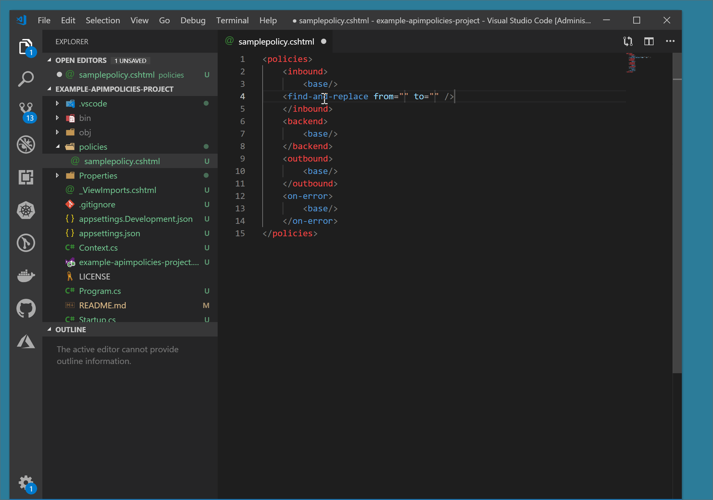

# example-apimpolicies-project

Experimental project to demonstrate completions in policy documents for azure api management using VSCode Razor Tooling.

Steps..
1. clone the repo
2. run "dotnet build"
3. start editing the samplepolicy.cshtml under policies directory.

The project is a simple asp.net core web app that is created using command “dotnet new web”.

The Context.cs has all the types needed to suffice context variable and its properties. 

The _ViewImports.cshtml injects context variable into all cshtml files. Making context variable accessible to all policy files.

This project can be taken further to have tag helpers.

