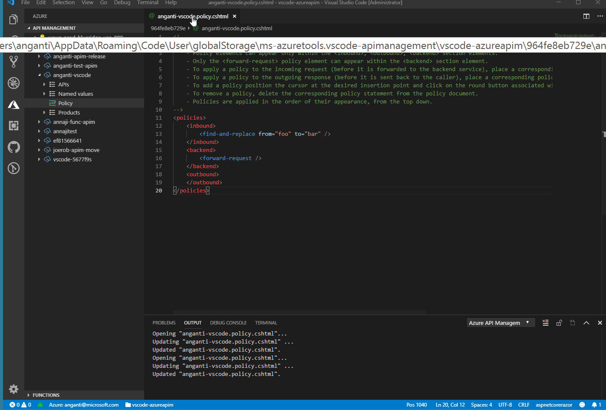

# example-apimpolicies-project

Experimental project to demonstrate completions in policy documents for azure api management using VSCode Razor Tooling.

Steps..
1. clone the repo
2. run "dotnet build"
3. start editing the samplepolicy.cshtml under policies directory.

The project is a simple asp.net core web app that is created using command “dotnet new web”.

The Context.cs has all the types needed to suffice context variable and its properties. 

The _ViewImports.cshtml injects context variable into all cshtml files. Making context variable accessible to all policy files.

This project can be taken further to have tag helpers.

# Working with VSCode Extension (One-Time Setup)

The policy files are generated under extension global storage path.
Windows: %appdata%\Code\User\globalStorage\ms-azuretools.vscode-azurefunctions\vscode-azureapim

Hint: After opening a policy file through the extension, hover over the file to find exact location.

Open the folder in VSCode.
%appdata%\Code\User\globalStorage\ms-azuretools.vscode-azurefunctions\vscode-azureapim

From the VSCode terminal navigate to folder 
%appdata%\Code\User\globalStorage\ms-azuretools.vscode-azurefunctions\vscode-azureapim

Run "dotnet new web" (Assuming you already have installed dotnet tools and C# VSCode Extension)
This will create an empty asp.net core project which will enable Razor tooling in VSCode.

Copy files
https://github.com/anganti/apimanagement-policy-authoring/blob/master/Context.cs
https://github.com/anganti/apimanagement-policy-authoring/blob/master/_ViewImports.cshtml

Run "dotnet build"

TADA!! Now you are setup to work with policy documents. With completions for context variable and standard .net libraries.

